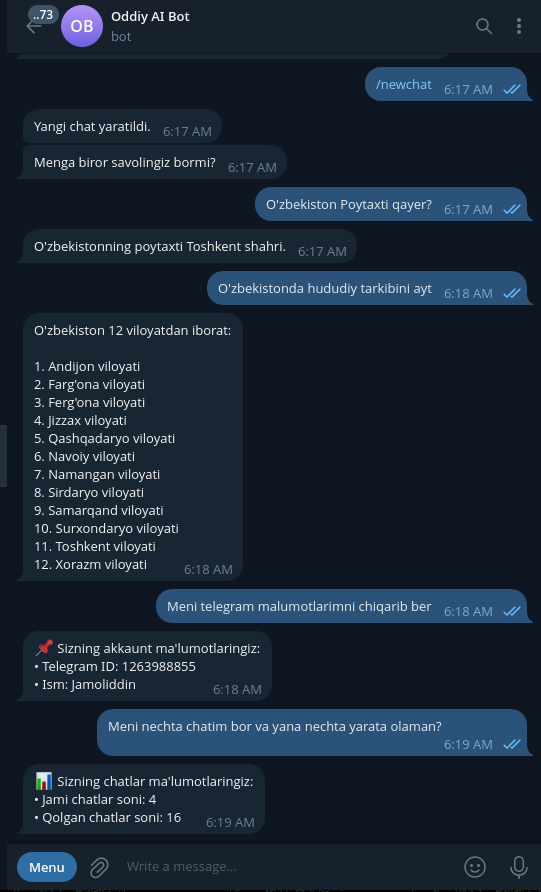
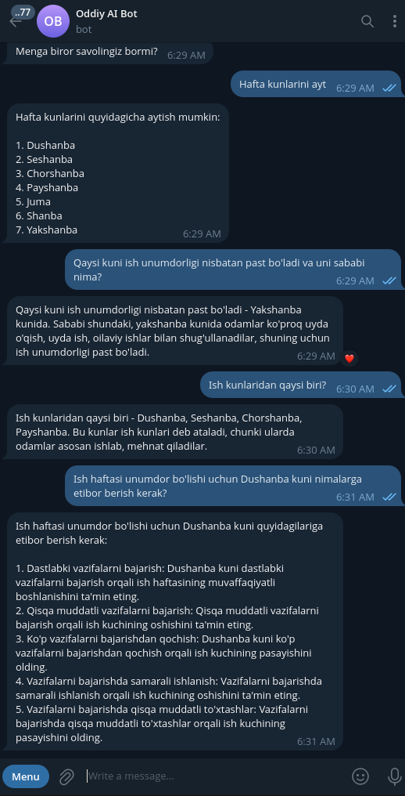

# Oddiy AI BOT

## Umumiy maqsadlar uchun chatbot.
## Demo
Telegram bot: https://t.me/OddiyAI_bot
## 🚀 O‘rnatish

1. Repository’ni yuklab oling:

```bash
git clone https://github.com/xterraname/oddiy-ai-bot.git
cd oddiy-ai-bot
```

2. Virtual muhit yarating:

```bash
python -m venv venv
source venv/bin/activate  # Linux/Mac
venv\Scripts\activate     # Windows
```

3. Kutubxonalarni o‘rnating:

```bash
pip install -r requirements.txt
```

---

## ⚙️ Sozlamalar

### .env.example

```env
DB_NAME="bot.db"

# Username: @bot_user_name
BOT_TOKEN="Your_Token"

TOGETHER_API_KEY="Together_API_Key"
```

```bash
cp .env.example .env
# .env faylida sozlamalarni to'ldiring
```

---

## ▶️ Ishga tushirish

```bash
python bot.py
```

## AI Model

```Meta Llama 3.1 8B Instruct Turbo```

Ushbu model tanlanganimning sabablari:
- Nisbatan yengil va tez javob qaytardi
- Javoblari nisbatan aniqroq
- O'zbek tilida javob berishi shu kabi modellardan sifatliroq ekan
- Narxi arzon ($0.18 - 1mln token uchun) va bepul crediti bor ($1)

## Namunalar

 


